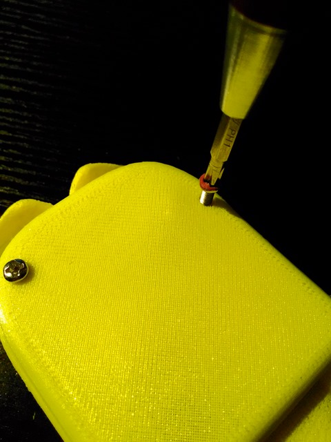
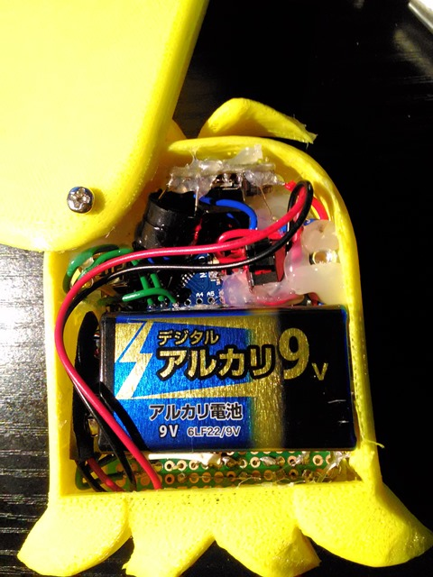
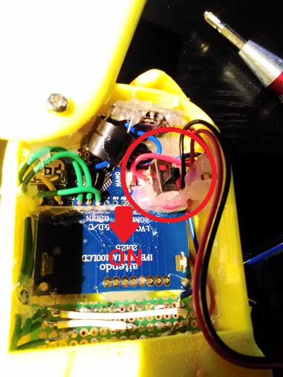
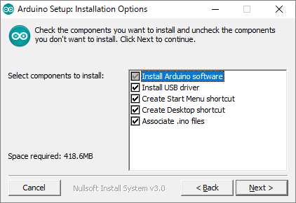
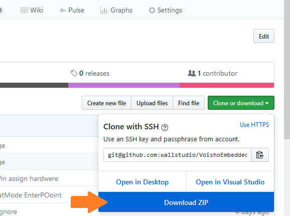
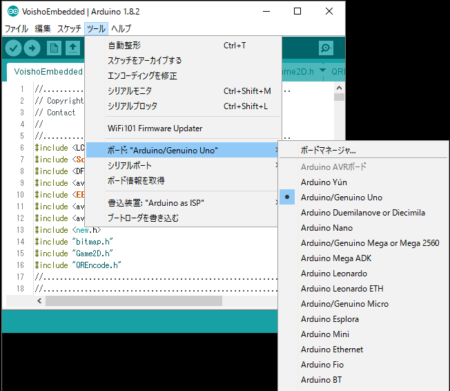
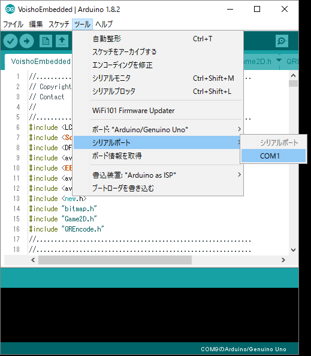
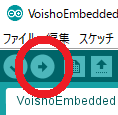

# けだまっち 取り扱いマニュアル  

常に最新版を確認してください．  
[https://github.com/wallstudio/VoishoEmbedded/blob/master/Misc/Manual.md](https://github.com/wallstudio/VoishoEmbedded/blob/master/Misc/Manual.md)  
  

* 製作者情報  
うｐﾊｼ （WallStudio）   
Twitter @yukawallstudio  
メール yukawallstudio＠gmail.com  

* 権利表記  
  
&copy;2017 WallStudio  
私的利用の範囲を逸脱した利用を禁じます．  
「弦巻マキ」および「結月ゆかり」は株式会社AHSのキャラクターです．  
けだまっちは申請名「VOIしょ（仮）」としてこの作品は株式会社AHSにて許諾を受けています．  
「けだマキマキ」は@AlucarDx2氏と@sakadynamic氏による弦巻マキの二次創作作品を@Omae_Dahlia氏がミックスアレンジしたものです．  
「けだマキマキ」二次利用は@Omae_Dahlia氏，@AlucarDx2氏，@sakadynamic氏に許諾を受けています．  

## 目次  
1. けだまっちとは？
2. 注意事項
3. 使い方
4. 育て方
5. 免責事項
6. （アップデート）

## 1. けだまっちとは？  
けだまっちとはVOICEROID弦巻マキの派生キャラクター「**けだマキマキ**」をモチーフにしたグッズです．  
液晶パネルとコンピューターを搭載し，けだマキマキの育成が楽しめることを目標に作られました．

## 2. 注意事項  
* 工業製品の安全基準を満たしたものではありません．使用する際には**ご自身で十分に安全なことを確認**の上お使いください．
* 安全管理の難しいお**子様には与えないで**ください．
* 棘やバリが残っている箇所があります．また，内部は電子回路がむき出しの為電池交換の際は十分に注意をはらってください．
* 致死レベルではありませんが，高めの電圧を扱っていますので感電に注意してください．触れた手で触れることがないようにしてください．
* 60度くらいで筐体が柔らかくなり始めます．**高温下で保管しない**でください．また，発熱を始めたら使用を中止してください．
* 部品の特性で機械自体の寿命があります．理論上は数年～数十年持ちますが，状態・環境によっては数か月に縮むかもしれません．

## 3．使い方  
### 初めての起動
1. 背面の**色のついたネジ**を外しカバーを開けます．  

1. 乾電池の端子についた絶縁体を取り除きます．

1. 背面のカバーを閉じます．ネジでかるく固定してください．

1. 正面のボタンのいずれかを長押し（～10秒）してください．

1. HOME画面が表示されます．
### SLEEPモード
1. HOME画面で右ボタンをおすとSLEEPモードになります．この状態にしておくこと電池の持ちがよくなります．この間も内部の時間は進み続けますが，成長イベントの通知はないので注意が必要です．

1.  正面のボタンのいずれかを長押し（～10秒）するとSLEEPモードから復帰します．

### 電池交換
1. 使用する乾電池は 6LR61 または 6F22です．これはコンビニや100円ショップでも売られている四角い9Vのものです．（6V以上の電圧が得られるようにしてください）

1. 背面のネジを外しカバーを開けます．

1. 入っている電池をコネクタの端子部分をつまんで外します．

1. 正極負極を確認して新しい電池を接続します．

1. 背面のカバーを閉じます．ネジでかるく固定してください．

### 外部電源
USBから電源を取ることが出来ます．端子はMini USBです．これは一般的なスマートフォンの端子（Micro USB）とは互換性が無いので注意してください．Mini USBケーブルは家電量販店や100円ショップでも手に入ります．  
※乾電池がつながっているときは乾電池が優先して消費されますので，乾電池を外して繋げてください．
### オーディオの切り替え
けだまっちはスピーカーを搭載していて音が出ます．しかしながら，アンプがかなりの電力を消費するため，手動でOFFにすることが出来ます．
1. 背面のネジを外しカバーを開けます．

1. スイッチがあるので切り替えます．（下側がオーディオON，上側がオーディオOFFです）

1. 背面のカバーを閉じます．ネジでかるく固定してください．

### 操作
1. ボタンは3つあり，画面の下部に対応した位置にそれぞれのボタンの意味が表示されます．（例: HOME画面では，右ボタンがSLEEP，中央ボタンがMENUE，左ボタンは無効になっています）

## 4. 育て方  
初めて電源を入れた際，けだマキマキはまだ幼体でアホ毛に足がついたような見た目をしています．地道に育てていくことで立派なけだマキマキへと成長していきます．  
### 体力
HOME画面の左上に表示される「✙」が残り体力です．最大3で世話を怠ると減っていき0になると死んでしまいます．減ってしまった体力は世話を焼き良好な状態を保つことで自動回復します．
  
### 好感度
HOME画面の右上に表示される「♥」が現在の好感度です．最大の3まで溜まると1段階成長します．また，成長直後は0にリセットされます．成長は2段階です．  
世話を焼き良好な状態を保つと好感度は上昇し，病気・空腹・汚れを放置すると減少します．
### 新陳代謝
けだマキマキは生き物ですから，お腹がすいたり病気になることもあります．
* 空腹   
時間経過で発生します．放置すると体力が減っていきます．  
「MENUE → ｺﾞﾊﾝ」でごはんをあげると回復します．
時間経過で発生します．  
* 汚れ!     
時間経過で発生します．  
「MENUE → ｿｳｼﾞ」で落ちた毛を処分できます．
* 病気   
空腹や汚れが溜まっていると発生します．体力が減り続けます．  
「MENUE → ﾅﾃﾞﾙ」で手当てをし完全に治癒することができます．
### ミニゲーム  
* けだマキマキともぐら叩きゲームができます．強く叩くと可哀そうなので優しくタイミングよくボタンを押しましょう．
  
### ギャラリー  
けだマキマキの様々な姿を鑑賞することができます．
### 通信  
QRコードが表示されそれを読み込むことで他の機器と連携ができます．この機能は使われていません．
### 設定  
2つの設定項目とデータの初期化ができます．設定を変更した場合の動作確認が不十分であるため，設定を変更することは非推奨となっています．
* VOLUEM
オーディオの音量を調整します．
* LIGHT
バックライトのON/OFFを切り替えます．
* CLEAR
セーブデータを全て削除し，初期状態に戻します．
### チートモード
掃除中に3つのボタンすべてを同時押しし再起動するとチートモードになり成長が早くなります．セーブデータを消すと元に戻ります．また，イベント中に楽しんでいただけるようにチートモードONの状態でお渡しします．

## 5. 免責事項  
けだまっちを購入・利用する際は**以下に同意**する必要があります．  

けだまっちは十分な品質管理ができておりません．個体によってその品質が大きく異なります．**これは不良ではありません**．ソフトウェアの**パッチも作成しません**．お渡しする際の状態が全てです．

けだまっちで怪我及びその他の損害を被った場合でも製作者が**補償することはできません**．  
けだまっちそのものの**アフターサポートは基本的に行えません**．一応，ご連絡いただければお答えするかもしれませんが，これは必ずできるものではありません．

けだまっちが故障した場合の修理は**無償・有償含め行えません**．設計書は公開（[https://github.com/wallstudio/VoishoEmbedded (Github)](https://github.com/wallstudio/VoishoEmbedded)）されているので，ご自身で修理する助けになるかもしれません．

## 6. アップデート
基本的にアップデートによるサポートはありませんが，場合によってはアップデートを配信する可能性はあります．その際には以下の手順でPC経由によるアップデートを行うことが出来ます．（Windows10以降だとドライバが不要で楽です）
1. Arduino IDEのインストール  
PCで [https://www.arduino.cc/en/main/software](https://www.arduino.cc/en/main/software) よりArduino IDEをダウンロードします．（Arduinoに寄付をしない場合「Just download」を選べばダウンロードが始まります）
2. Arduino IDEのインストーラからインストールを実行します．  
 
3. Mini USBケーブルでPCとけだまっちをつなぎます．  
PCに認識されない場合，CH340ドライバをインストールしてください．
4. ソースコードのダウンロード  
[https://github.com/wallstudio/VoishoEmbedded](https://github.com/wallstudio/VoishoEmbedded) よりプロジェクトをダウンロードします．
 
5. 解凍し「VoishoEmbedded.ino」をArduino IDEで開きます．
6. 「ツール」 → 「ボード」で「Arduino Genuino/Uno」を選択，「ツール」 → 「シリアルポート」で新しく追加されたCOMポートを選択（普通COM1の外にもう一つCOMが現れるので，それを選んでください．）
 
 
7. コンパイルボタンを押します．  
 
8. 「スケッチのアップロードが完了しました」と表示されれば成功です．エラーが出る場合ここまでの手順を再確認してください．